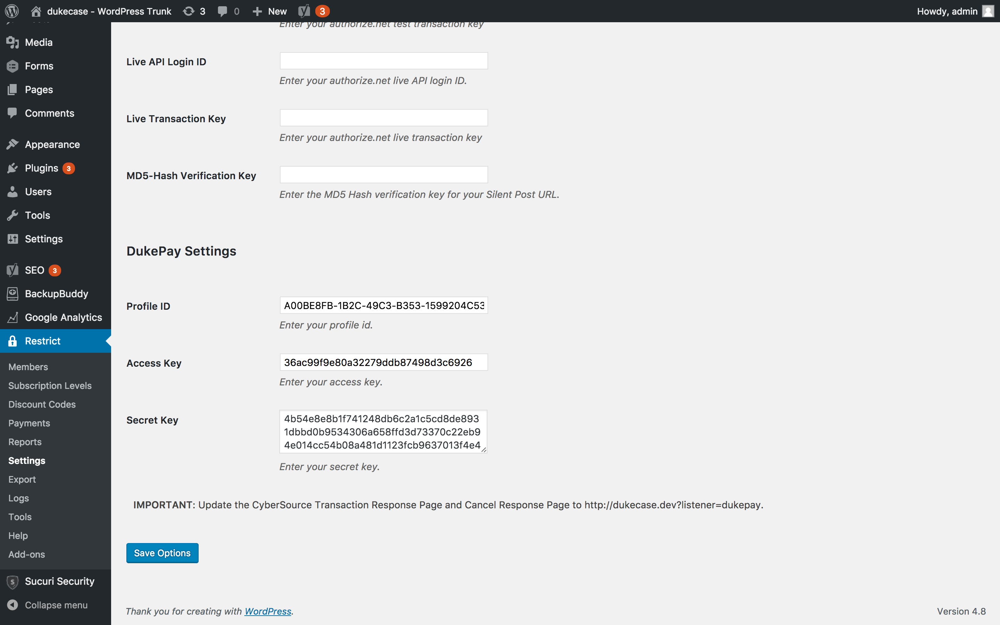
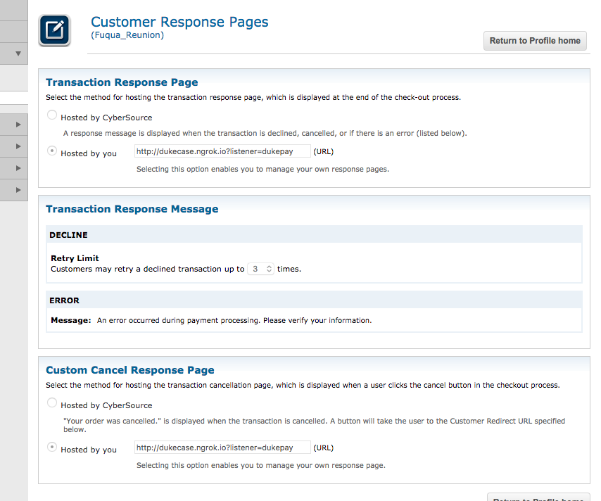
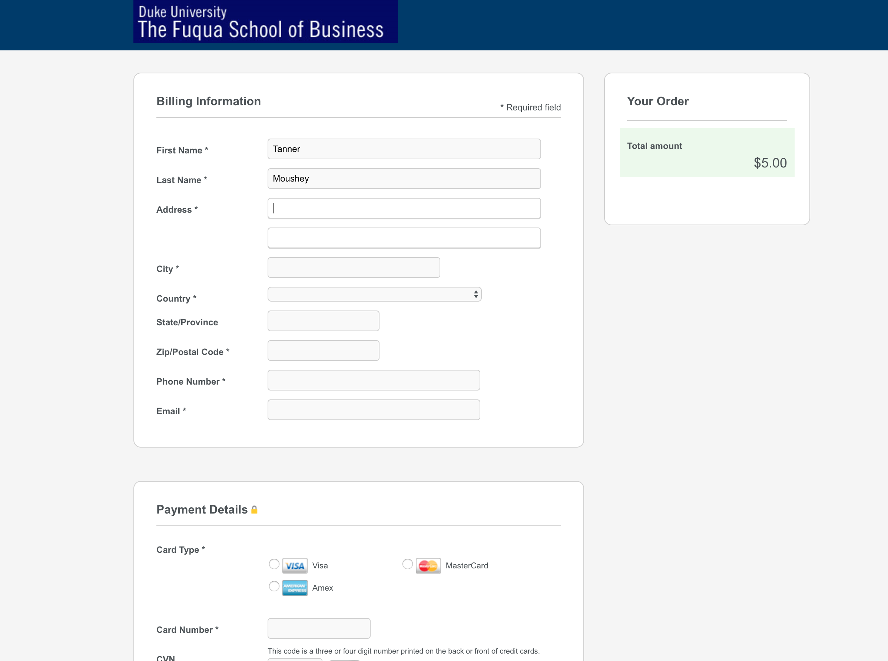

# Commbank
A custom payment gateway for Commbank

## Setup
Once the plugin is installed and activated, go to the *Restrict Settings* page in the WordPress Admin (Restrict &rarr; Settings).

Select the *Payments* tab and add the Commbank **Profile ID**, **Access Key**, and **Secret Key**. These settings are found in the *CyberSource Dashboard* in the *Profiles* area (Tools & Settings &rarr;  Profiles &rarr; {select the right profile}). Also enable **Commbank** at the top of the page.

In the *CyberSource Dashbard*, update the *Customer Response Pages* for **Transaction Response Page** and **Cancel Response Page** to match the endpoint given in the *RCP Payment* tab in the *Commbank Settings* area.

## Testing
Navigate to the *Registration Page* and create a new user. When the form is submitted, you will be taken to the Commbank checkout page. Once completed you will be redirected back. Any errors will be displayed on the registration form. If there were no errors, then the member will become active and be redirected to the welcome page.

